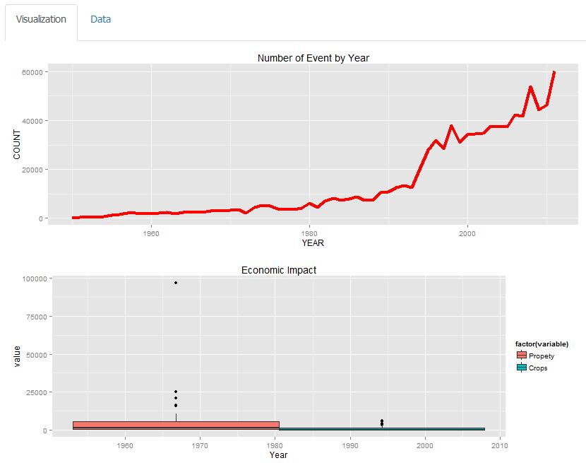

StromData - Coursera shiny project
========================================================
author: Joseph
date: November 21 2015

<small>
Application **StormData Explorer** facilitate user to explore the severe weather events which can cause both public health and economic problems.
</small>


Data Set
========================================================
The Dataset is the same file we used for the Cousera's Reproduciable Research Course.This is the aggregated data from the original data set. This data set have the following features.

- YEAR
- STATE
- EVTYPE
- COUNT
- FATALITIES
- INJURIES
- PROPDMG(Property damage)
- CROPDMG(Crop damage)

========================================================

```r
summary(data)
```

```
      YEAR                 STATE      
 Min.   :1950   california    :  453  
 1st Qu.:1987   texas         :  421  
 Median :1999   pennsylvania  :  420  
 Mean   :1994   virginia      :  417  
 3rd Qu.:2005   north carolina:  416  
 Max.   :2011   florida       :  415  
                (Other)       :15072  
                              EVTYPE         COUNT        
 TORNADO                         :2682   Min.   :   1.00  
 THUNDERSTORM / THUNDERSTORM WIND:2677   1st Qu.:   4.00  
 HAIL                            :2555   Median :  12.00  
 WIND                            : 935   Mean   :  50.13  
 FLASH FLOOD                     : 905   3rd Qu.:  38.00  
 LIGHTNING                       : 895   Max.   :1794.00  
 (Other)                         :6965                    
   FATALITIES          INJURIES           PROPDMG        
 Min.   :  0.0000   Min.   :   0.000   Min.   :    0.00  
 1st Qu.:  0.0000   1st Qu.:   0.000   1st Qu.:    0.00  
 Median :  0.0000   Median :   0.000   Median :    0.01  
 Mean   :  0.8422   Mean   :   7.917   Mean   :   17.58  
 3rd Qu.:  0.0000   3rd Qu.:   1.000   3rd Qu.:    0.89  
 Max.   :626.0000   Max.   :6110.000   Max.   :31734.50  
                                                         
    CROPDMG        
 Min.   :   0.000  
 1st Qu.:   0.000  
 Median :   0.000  
 Mean   :   2.746  
 3rd Qu.:   0.000  
 Max.   :5000.050  
                   
```


Shiny Framework
========================================================
The Shiny framework is used develop the application. 
 - In the application, left side options are available for the users to select the year range and also the event types.
 - Based on the user selection, it will dynamically adjust the plots.

Interactive Plots(using ggplot)
========================================================
The plots are interactive using ggplot.




You can find the this shiny application at url:<a href="https://joearockiam.shinyapps.io/DataProducts">https://joearockiam.shinyapps.io/DataProducts</a> 


